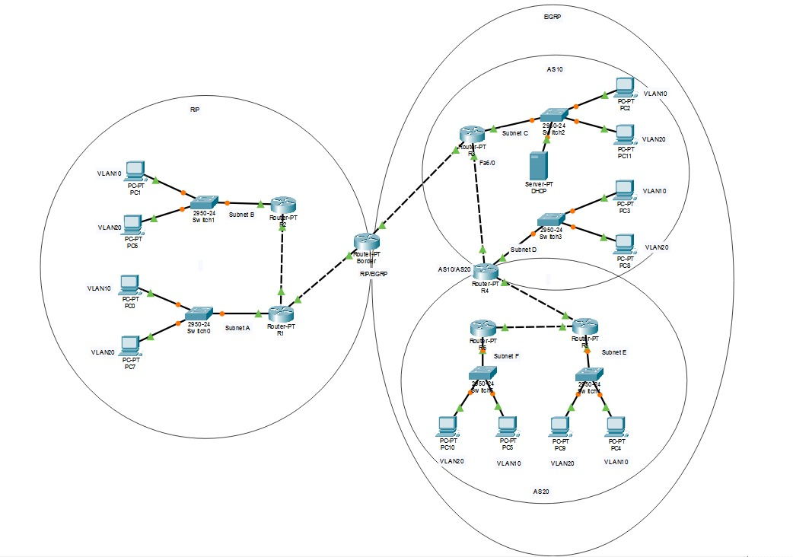

# Relatório AV2

Pedro H. Gaya - 2224655

---

## Resumo

Para este projeto, foram estabelicidos dois domínios - RIP e EIGRP. Ambos os domíninos compartilham de duas VLANs - 10 e 20. Em cada domínio, foram criados subnets, com um roteador por subnet. Toda subnet possui dois PCs, um por VLAN.

- RIP:
  - A: Switch0, R1, PC0, PC7
  - B: Switch1, R2, PC1, PC6
- AS10:
  - C: Switch2, R3, PC2, PC11, DHCP
  - D: Switch3, R4, PC3, PC8
- AS20:
  - E: Switch4, R5, PC4, PC9
  - F: Switch5, R6, PC5, PC10
- Dsitribuidores:
  - RIP/EIGRP: Border
  - AS10/AS20: R4

## Cálculos de Sub-redes

### Máscara /26 — Redes LAN

Cada rede /24 foi dividida em sub-redes /26, fornecendo 62 hosts utilizáveis por sub-rede.

- Bits de host: 6 → 2^6 - 2 = **62 hosts**
- Máscara: 255.255.255.192
- Tamanho do bloco: 64

| Sub-rede      | Endereço de Rede | Primeiro | Último    | Broadcast |
| ------------- | ---------------- | -------- | --------- | --------- |
| /26 (VLAN 10) | x.x.x.0          | x.x.x.1  | x.x.x.62  | x.x.x.63  |
| /26 (VLAN 20) | x.x.x.64         | x.x.x.65 | x.x.x.126 | x.x.x.127 |

### Máscara /30 — Links WAN

Usada nos links ponto a ponto entre roteadores, fornecendo exatamente 2 hosts.

- Bits de host: 2 → 2^4 - 2 = **2 hosts**
- Máscara: 255.255.255.252
- Tamanho do bloco:: 4

---

## Plano de Endereçamento IP

### Redes WAN

| Roteador A | IP Lado A | Roteador B | IP Lado B | Rede        |
| ---------- | --------- | ---------- | --------- | ----------- |
| R1         | 10.0.1.1  | R2         | 10.0.1.2  | 10.0.1.0/30 |
| R1         | 10.0.2.1  | Border     | 10.0.2.2  | 10.0.2.0/30 |
| Border     | 10.0.3.1  | R3         | 10.0.3.2  | 10.0.3.0/30 |
| R3         | 10.0.4.1  | R4         | 10.0.4.2  | 10.0.4.0/30 |
| R4         | 10.0.5.1  | R5         | 10.0.5.2  | 10.0.5.0/30 |
| R5         | 10.0.6.1  | R6         | 10.0.6.2  | 10.0.6.0/30 |

### Redes LAN

| Subnet       | Roteador | VLAN | Rede         | Máscara | Gateway      |
| ------------ | -------- | ---- | ------------ | ------- | ------------ |
| A            | R1       | 10   | 192.168.1.0  | /26     | 192.168.1.1  |
| A            | R1       | 20   | 192.168.1.64 | /26     | 192.168.1.65 |
| B            | R2       | 10   | 192.168.2.0  | /26     | 192.168.2.1  |
| B            | R2       | 20   | 192.168.2.64 | /26     | 192.168.2.65 |
| C            | R3       | 10   | 192.168.3.0  | /26     | 192.168.3.1  |
| C            | R3       | 20   | 192.168.3.64 | /26     | 192.168.3.65 |
| D            | R4       | 10   | 192.168.4.0  | /26     | 192.168.4.1  |
| D            | R4       | 20   | 192.168.4.64 | /26     | 192.168.4.65 |
| E            | R5       | 10   | 192.168.5.0  | /26     | 192.168.5.1  |
| E            | R5       | 20   | 192.168.5.64 | /26     | 192.168.5.65 |
| F            | R6       | 10   | 192.168.6.0  | /26     | 192.168.6.1  |
| F            | R6       | 20   | 192.168.6.64 | /26     | 192.168.6.65 |
| C (Servidor) | R3       | 10   | 192.168.3.10 | /26     | 192.168.3.1  |

---

## Implementação

### Switches

Configuração das VLANs e portas em todos os switches (Switch0 a Switch5):

- Criação das VLANs 10 e 20
- Portas de acesso para os hosts em cada VLAN
- Porta trunk para o roteador carregando ambas as VLANs

### Roteadores

Duas subinterfaces foram criadas: Uma por VLAN. Cada link WAN recebe um endereço /30 em cada extremidade.

- Domínio RIP (R1, R2, Border): RIP configurado com `no auto-summary` para suportar as sub-redes /26 e /30. Cada roteador anuncia suas redes diretamente conectadas.
- Domínio EIGRP AS10 (R3, R4, Border): EIGRP processo 10 configurado para cada sub-rede /26. Border participa do AS10 pelo lado EIGRP.
- Domínio EIGRP AS20 (R5, R6, R4): EIGRP processo 20 configurado em R5 e R6. R4 executa ambos os processos (AS10 e AS20) simultaneamente, sendo a fronteira entre os dois AS.

Foram criados dois pontos de redistribuição na topologia:

- **Border**: redistribui RIP para EIGRP AS10 e EIGRP AS10 para RIP
- **R4**: redistribui EIGRP AS10 para AS20 e EIGRP AS20 para AS10

R1 serve DHCP diretamente para as VLANs 10 e 20 da subnet A, com pools locais e IPs excluídos para os gateways.

Para as outras subnets, o servidor DHCP centraliza a distribuição de endereços. Os roteadores R2, R3, R4, R5 e R6 utilizam `ip helper-address` nas interfaces para encaminhar os pedidos DHCP ao servidor.

### PCs e Servidor

Todos os PCs foram configurados com DHCP.

O servidor DHCP foi configurado com IP estático 192.168.10.3, na subrede C, conectado ao roteador R3 pelo Switch2. Foi criada duas pools DHCP para cada subrede, sendo uma por vlan.

---

## Comandos Utilizados

### VLANs e Trunk (Switch)

| Comando                               | Função                                       |
| ------------------------------------- | -------------------------------------------- |
| `vlan 10`                             | Cria a VLAN 10                               |
| `switchport mode access`              | Define a porta como acesso                   |
| `switchport access vlan 10`           | Associa a porta à VLAN 10                    |
| `switchport mode trunk`               | Define a porta como trunk                    |
| `switchport trunk allowed vlan 10,20` | Permite apenas as VLANs necessárias no trunk |

O mesmo foi feito para vlan 20.

### Subinterfaces

| Comando                                  | Função                                                     |
| ---------------------------------------- | ---------------------------------------------------------- |
| `interface fastethernet0/0.10`           | Cria subinterface para VLAN 10                             |
| `encapsulation dot1Q 10`                 | Define encapsulamento 802.1Q com VLAN 10                   |
| `ip address 192.168.1.1 255.255.255.192` | Atribui IP à subinterface, que atuará como gateway da VLAN |

### RIP

| Comando                 | Função                                                      |
| ----------------------- | ----------------------------------------------------------- |
| `router rip`            | Ativa o processo RIP                                        |
| `no auto-summary`       | Desativa sumarização automática (necessário para /26 e /30) |
| `network 192.168.1.0`   | Anuncia a rede no RIP                                       |
| `redistribute eigrp 10` | Injeta rotas EIGRP no RIP                                   |

### EIGRP

| Comando                                             | Função                                           |
| --------------------------------------------------- | ------------------------------------------------ |
| `router eigrp 10`                                   | Ativa o processo EIGRP com AS número 10          |
| `no auto-summary`                                   | Desativa sumarização automática                  |
| `network 192.168.3.0 0.0.0.63`                      | Anuncia a sub-rede usando wildcard preciso       |
| `redistribute rip metric 10000 100 255 1 1500`      | Injeta rotas RIP no EIGRP com métrica composta   |
| `redistribute eigrp 20 metric 10000 100 255 1 1500` | Redistribui rotas entre sistemas autônomos EIGRP |

### DHCP

| Comando                               | Função                                                 |
| ------------------------------------- | ------------------------------------------------------ |
| `ip dhcp excluded-address`            | Reserva IPs que não serão distribuídos automaticamente |
| `ip dhcp pool NOME`                   | Cria um pool DHCP com o nome especificado              |
| `network 192.168.1.0 255.255.255.192` | Define a rede do pool                                  |
| `default-router 192.168.1.1`          | Define o gateway entregue aos clientes                 |
| `dns-server 8.8.8.8`                  | Define o servidor DNS entregue aos clientes            |
| `ip helper-address 192.168.3.10`      | Encaminha broadcasts DHCP ao servidor remoto           |

## Bibliografia

Uma demonstração do funcionamento da rede pode ser encontrada [aqui](https://youtu.be/SPWk1a4vCYo).
Todos os arquivos utilizados nesse projeto estão disponíveis no [GitHub](https://github.com/PedroGaya/av2-redes).
